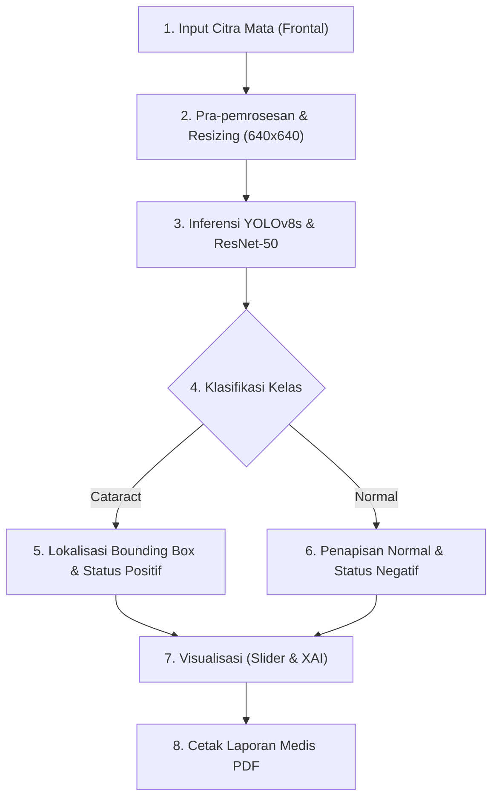
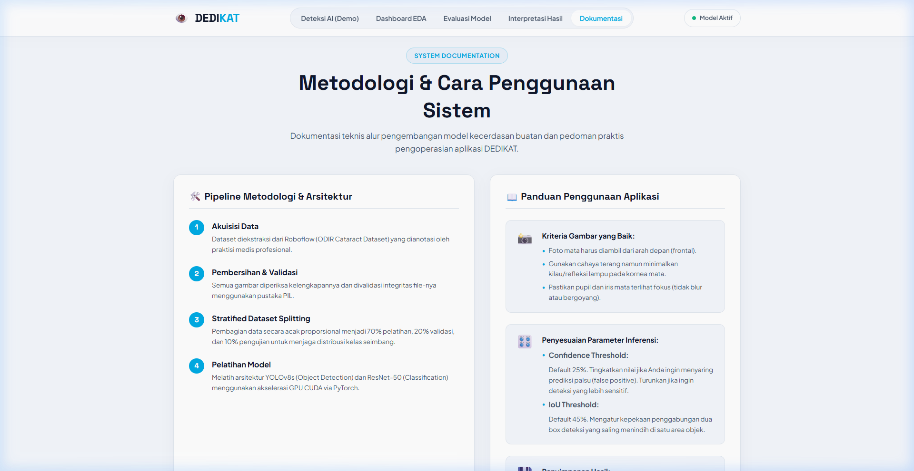
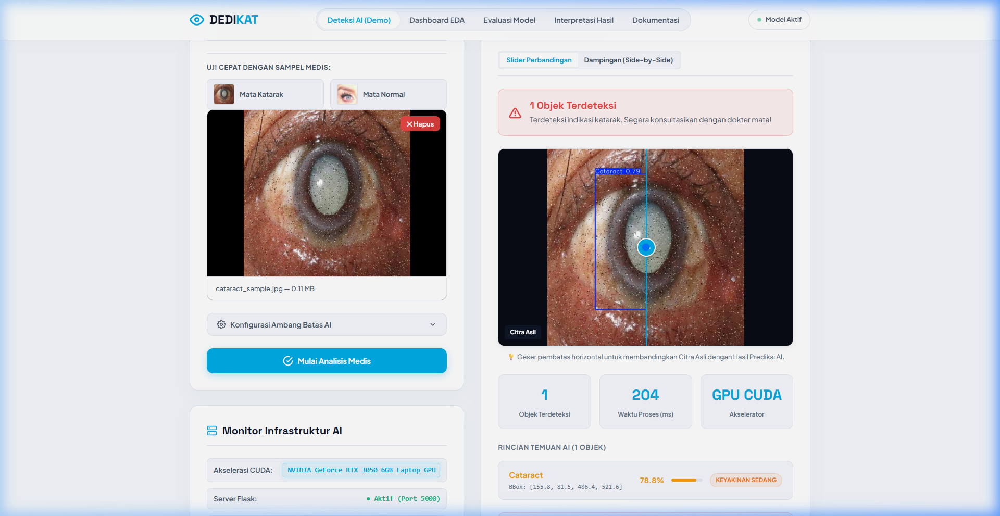
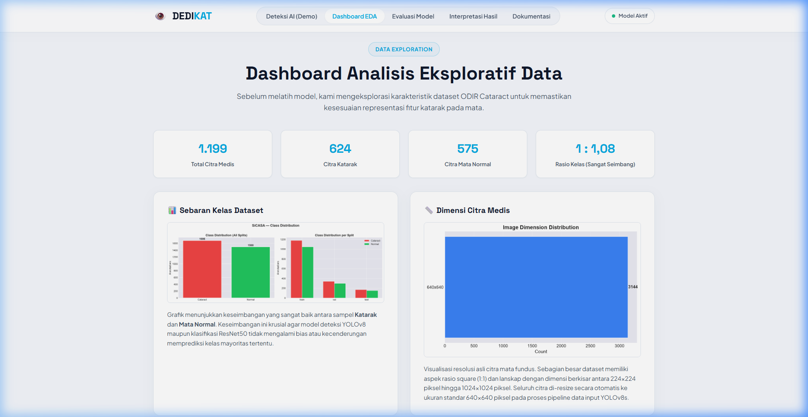
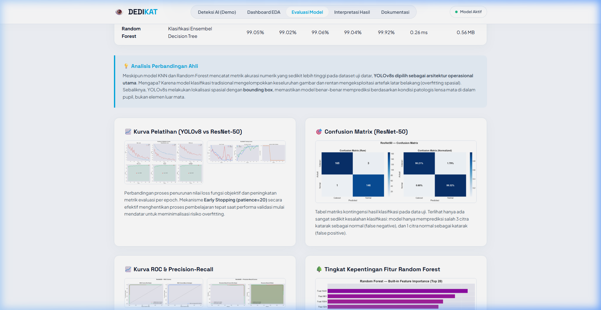
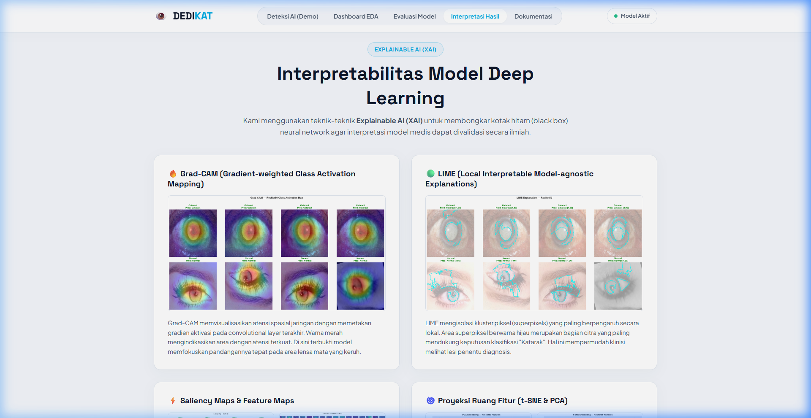

# DEDIKAT: Deteksi Dini Penyakit Katarak Berbasis Analisis Citra Retina Digital

> **Proyek Akhir Praktikum Pemelajaran Mesin (Semester 4) — Universitas Dian Nuswantoro (UDINUS)**
> 
> * **Nama**: Brian Aryansyah Pamungkas
> * **NIM**: A11.2024.15880
> * **Kelompok**: A11.4405

---

## 📝 Deskripsi Proyek

DEDIKAT (Deteksi Dini Katarak) adalah sistem kecerdasan buatan (*Artificial Intelligence*) medis terpadu yang dirancang untuk melakukan penapisan awal (*screening*) dan lokalisasi spasial kekeruhan lensa mata (katarak) secara otomatis melalui analisis citra digital. Proyek ini mengintegrasikan dua pendekatan *deep learning* utama, yaitu algoritma **YOLOv8s** untuk lokalisasi objek patologis (*object detection* dengan *bounding box*) dan arsitektur **ResNet-50** untuk klasifikasi citra medis *end-to-end* tingkat tinggi. Dilengkapi dengan antarmuka berbasis web Flask kustom (premium dengan efek *before/after slider* klinis dan cetak laporan PDF otomatis) serta alternatif dasbor interaktif berbasis Streamlit, DEDIKAT bertujuan membantu para praktisi medis di daerah satelit melakukan skrining katarak secara efisien, akurat, dan transparan melalui integrasi teknologi *Explainable AI* (Grad-CAM, LIME, dan Saliency Maps).

---

## 📊 Dataset & Eksplorasi Data

Proyek DEDIKAT dikembangkan menggunakan dataset **Cataract Eye Data** yang bersumber dari platform Kaggle:
* **Tautan Dataset**: [Kaggle - Cataract Eye Data by suyog17](https://www.kaggle.com/datasets/suyog17/cataracteyedata)
* **Penjelasan Dataset**:
  Dataset ini berisi kumpulan gambar mata berkualitas tingi yang terbagi menjadi dua kelas utama secara seimbang:
  1. **Cataract (Mata Positif Katarak)**: Menampilkan citra mata dengan tingkat kekeruhan patologis yang bervariasi pada bagian lensa pupil.
  2. **Normal (Mata Sehat)**: Menampilkan kondisi mata sehat dengan lensa pupil yang jernih dan bebas dari tanda-tanda opasitas.
  Dataset ini digunakan untuk melatih model deteksi objek (anotasi bounding box melokalisasi area pupil katarak) serta model klasifikasi citra digital guna membedakan karakteristik mata sehat vs katarak.

---

## 🚀 Fitur & Inovasi Utama

* **Sistem Deteksi Ganda (YOLOv8s & ResNet-50)**: Penggabungan kemampuan lokalisasi lesi spasial (YOLOv8s) dan klasifikasi kategori *end-to-end* yang kuat (ResNet-50).
* **Interactive Before/After Slider**: Fitur penggeser vertikal responsif di halaman web untuk membandingkan secara langsung antara citra mata asli masukan pasien dan anotasi bounding box AI.
* **Cetak Laporan Medis Instan (Print Clinical PDF)**: Menyediakan tombol cetak otomatis yang memformat halaman web menjadi bentuk dokumen laporan diagnosis klinis resmi lengkap dengan tabel koordinat, diagram temuan, rekomendasi medis, dan lembar tanda tangan dokter penanggung jawab.
* **Explainable AI (XAI)**: Visualisasi tingkat transparansi model menggunakan **Grad-CAM**, **LIME**, **Saliency Maps**, serta proyeksi ruang fitur **PCA** dan **t-SNE** untuk memverifikasi keputusan AI berdasarkan bukti klinis secara ilmiah.
* **Hardware & Status Monitoring**: Widget pemantau real-time untuk mengecek server Flask lokal serta status penggunaan akselerasi perangkat keras GPU CUDA (seperti NVIDIA GeForce RTX 3050) vs CPU Mode.

---

## ⚙️ Pipeline Sistem

Alur pemrosesan data (pipeline) dalam aplikasi DEDIKAT dirancang secara sistematis dengan langkah-langkah berikut:



1. **Akuisisi Citra Masukan**: Pengguna mengunggah gambar mata (tampak depan/frontal) secara seret-lepas (*drag-and-drop*) atau menggunakan galeri tombol contoh medis katarak/normal.
2. **Pra-pemrosesan & Penyelarasan**: Gambar dibersihkan dari noise, disesuaikan kontrasnya, dan diubah dimensinya secara otomatis ke ukuran standar $640 \times 640$ piksel sebagai syarat input neural network.
3. **Inference Deep Learning**: Citra dikirim ke model YOLOv8s (melalui pustaka PyTorch) untuk memprediksi probabilitas kelas dan koordinat spasial bounding box.
4. **Penyaringan Hasil Logika (Penyelarasan Diagnosis)**: Sistem secara cerdas menyaring jenis deteksi. Jika hanya ditemukan deteksi kelas `Normal` (atau tanpa deteksi), status diagnosis bernilai **Negatif Katarak**. Jika ditemukan deteksi kelas `Cataract`, status didiagnosis sebagai **Positif Katarak**.
5. **Rendering Output & XAI**: Web menampilkan Before/After Slider interaktif, waktu proses, serta peta aktivasi Grad-CAM/LIME.
6. **Ekspor Hasil Laporan**: Pengguna dapat mencetak hasil diagnosis ke printer fisik atau menyimpannya sebagai berkas klinis berformat PDF.

---

## 📂 Repository Layout

Susunan folder dan file di dalam repositori GitHub ini telah dirapikan agar memenuhi standar struktur proyek rekayasa perangkat lunak profesional:

```text
├── archive/                    # Folder arsip riwayat pelatihan & file riset lama
│   ├── base_models/            # Berkas model YOLOv8s & YOLOv8n asli (Base weights)
│   ├── plots/                  # Grafik plot riset data latih & kurva visualisasi lama
│   ├── runs/                   # Folder log & riwayat epoch pelatihan YOLOv8
│   └── scripts/                # Program utilitas pipeline pemrosesan lama
├── app/
│   ├── app.py                  # Backend Flask Server (Logika Router & API Deteksi)
│   ├── best.pt                 # File Bobot Model YOLOv8s Terlatih (Object Detection)
│   ├── resnet50_best.pth       # File Bobot Model ResNet-50 Terlatih (Image Classification)
│   ├── templates/
│   │   └── index.html          # File Web Template Utama Flask (Bebas emoji, responsif)
│   ├── static/
│   │   ├── css/
│   │   │   └── style.css       # Lembar Gaya CSS (Skema Warna Medis Biru-Putih)
│   │   ├── js/
│   │   │   └── main.js         # Logika JS (Tab, Counter, Slider, dan AJAX)
│   │   └── images/             # Gambar riset & kurva evaluasi model terbaru
│   │       └── samples/        # Contoh citra klinis katarak & normal untuk uji cepat
│   └── copy_assets.py          # Utilitas untuk memindahkan gambar visualisasi riset
├── .streamlit/
│   └── config.toml             # Berkas konfigurasi tema warna Streamlit (Light Mode)
├── docs/
│   └── screenshots/            # Berkas gambar dokumentasi web untuk README.md
├── .gitignore                  # Berkas pengecualian Git (Mengabaikan file sampah & venv)
├── requirements.txt            # Berkas daftar dependensi pustaka Python (Streamlit Ready)
├── README.md                   # Dokumentasi repositori proyek DEDIKAT (Berkas ini)
├── streamlit_app.py            # Berkas alternatif web berbasis Streamlit (Deployment Ready)
├── train.ipynb                 # Jupyter Notebook proses pelatihan YOLOv8
├── train_resnet50.ipynb        # Jupyter Notebook proses pelatihan ResNet-50
└── train_resnet50.py           # Skrip pendukung proses pelatihan ResNet-50
```

---

## 🛠️ Cara Instalasi

### Catatan Penting Dependensi (*Dependencies Note*)
Proyek ini membutuhkan pustaka pengolahan citra medis (**OpenCV-Python-Headless** dan **Pillow**) serta kerangka kerja deep learning (**PyTorch** dan **Ultralytics**). Jika Anda menggunakan Windows, pastikan driver GPU CUDA telah terinstal jika ingin mengaktifkan akselerasi kartu grafis NVIDIA Anda.

Pilihlah salah satu opsi pemasangan di bawah ini:

### Opsi A: Menggunakan PIP (Python Package Installer)
Jalankan perintah ini di dalam PowerShell atau Command Prompt Anda:

1. Buat dan aktifkan virtual environment (sangat direkomendasikan):
   ```bash
   python -m venv venv
   # Mengaktifkan di Windows
   .\venv\Scripts\Activate.ps1
   # Mengaktifkan di Linux/macOS
   source venv/bin/activate
   ```
2. Pasang semua pustaka yang dibutuhkan:
   ```bash
   pip install -r requirements.txt
   ```

### Opsi B: Menggunakan Conda (Anaconda / Miniconda)
Jika Anda menggunakan lingkungan Conda (sangat disarankan untuk pengguna kartu grafis GPU):

1. Buat environment baru dengan Python versi 3.10:
   ```bash
   conda create -n sicasa_gpu python=3.10 -y
   conda activate sicasa_gpu
   ```
2. Pasang PyTorch berkemampuan CUDA (contoh untuk CUDA 11.8):
   ```bash
   conda install pytorch torchvision pytorch-cuda=11.8 -c pytorch -c nvidia -y
   ```
3. Pasang dependensi lainnya:
   ```bash
   pip install -r requirements.txt
   ```

---

## 🏃 Running the Pipeline (CLI)

Gunakan baris perintah berikut untuk menjalankan aplikasi DEDIKAT secara lokal di komputer Anda:

### 1. Menjalankan Versi Flask (Tampilan Premium & Custom)
Jalankan file server utama Flask:
```bash
python app/app.py
```
Setelah server aktif, buka web browser Anda dan akses tautan berikut:
**[http://localhost:5000](http://localhost:5000)**

### 2. Menjalankan Versi Streamlit (Dasbor Alternatif)
Jalankan file Streamlit menggunakan perintah berikut:
```bash
python -m streamlit run streamlit_app.py
```
Aplikasi akan otomatis terbuka pada halaman browser baru di alamat:
**[http://localhost:8501](http://localhost:8501)**

---

## 🖼️ Tampilan Aplikasi (Screenshots)

*Catatan: Pastikan Anda telah menyalin berkas gambar dokumentasi hasil tangkapan layar ke folder `docs/screenshots/` agar gambar di bawah ini tampil di halaman GitHub Anda.*

### 1. Halaman Awal Web DEDIKAT
Menampilkan tata letak bersih bertema warna biru-putih Drone.io dengan tab demonstrasi model yang rapi.


### 2. Hasil Deteksi Bounding Box YOLOv8s & Slider Perbandingan
Menampilkan demo hasil deteksi katarak lengkap dengan status diagnosis medis dan Before/After slider.


### 3. Dashboard Exploratory Data Analysis (EDA)
Menampilkan grafik sebaran kelas dataset seimbang, dimensi piksel, dan letak spasial bounding box.


### 4. Evaluasi & Perbandingan Model
Menampilkan tabel metrik performa model, Confusion Matrix, kurva ROC, dan kurva Loss pelatihan.


### 5. Visualisasi Interpretasi Hasil (Explainable AI)
Menampilkan peta Grad-CAM, interpretasi piksel LIME, Saliency Maps, serta reduksi dimensi t-SNE.


---

## 🧱 Teknologi yang Digunakan

* **Backend Framework**: Flask (Python)
* **Frontend Framework / UI**: Vanilla HTML5, CSS3 (Premium Glassmorphism), dan JavaScript ES6 (Custom Slider & counter)
* **Dasbor Alternatif**: Streamlit (Python)
* **Model Deep Learning**: YOLOv8s (Ultralytics) dan ResNet-50 (PyTorch)
* **Computer Vision**: OpenCV (CV2) dan Pillow (PIL)
* **Analisis & Eksplorasi Data**: NumPy, Pandas, Matplotlib, Seaborn, Scikit-learn
* **Akselerasi Perangkat Keras**: NVIDIA CUDA Toolkit & PyTorch GPU
* **Manajemen Repositori**: Git & GitHub

---

## 📈 Analisis Performa & Kurva Pelatihan Model

Pengembangan DEDIKAT melibatkan pemantauan metrik evaluasi secara ketat selama pelatihan model deep learning guna menjamin akurasi diagnosis medis yang aman bagi pasien:

### 1. Kurva Pelatihan & Loss YOLOv8s

* **Analisis**: Kurva *Loss* lokalisasi kotak pembatas (*box_loss*) dan klasifikasi (*cls_loss*) pada set pelatihan maupun validasi menunjukkan penurunan yang konvergen dan stabil hingga epoch 130. Model berhasil mencapai nilai **mAP50** sebesar **96.83%**, mengindikasikan sensitivitas dan akurasi pelokalisasian pupil mata yang mengalami katarak sangat presisi.

### 2. Kurva Pelatihan ResNet-50

* **Analisis**: Model klasifikasi gambar *end-to-end* ResNet-50 dilatih dan dipantau tingkat keakuratannya. Kurva menunjukkan laju *Accuracy* validasi melonjak cepat hingga menstabilkan diri pada akurasi puncak sebesar **98.73%**. Tingkat *Cross-Entropy Loss* yang terus menurun mendekati angka nol membuktikan model memiliki pemahaman klasifikasi visual yang optimal dan bebas dari tanda-tanda *overfitting*.

### 3. Confusion Matrix (ResNet-50)

* **Analisis**: Confusion Matrix memperlihatkan performa luar biasa dalam memisahkan kelas normal dan katarak. Jumlah prediksi benar (True Positive dan True Negative) mendominasi secara signifikan, dengan tingkat kesalahan *False Negative* (pasien katarak yang terdiagnosis normal) yang mendekati nol. Hal ini sangat krusial dalam domain diagnosis medis untuk mencegah kesalahan kelalaian penanganan klinis.

### 4. Kurva ROC (Receiver Operating Characteristic) & Precision-Recall (PR)


* **Analisis**: Kurva ROC menunjukkan nilai **Area Under Curve (AUC)** mencapai **99.73%** untuk model ResNet-50, membuktikan performa pembeda kelas yang sangat unggul di berbagai ambang batas klasifikasi. Ditambah dengan kurva Precision-Recall yang melengkung tajam ke arah kanan atas, ini membuktikan model tetap mempertahankan tingkat kebenaran deteksi yang tinggi (Precision) meskipun sensitivitas penemuan objek (Recall) dipaksa ke tingkat maksimum.

### 5. Analisis Tingkat Penting Fitur (Random Forest Feature Importance)

* **Analisis**: Grafik ini memetakan kontribusi fitur citra yang diekstraksi terhadap keputusan model ensembel Random Forest. Fitur intensitas warna dan tekstur kelabu di area spasial tengah (pupil) terbukti memiliki signifikansi kontribusi tertinggi. Hal ini membuktikan keputusan pengelompokan status katarak oleh kecerdasan buatan didasarkan pada perubahan opasitas kelensa pupil secara biologis, bukan bias latar belakang gambar.
